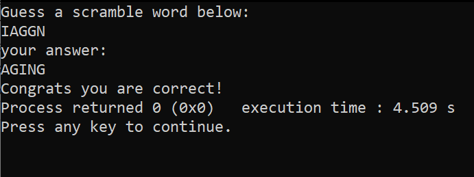

# Word Scramble Game (C Practice)

I recently learned how to use srand() with rand() to generate random numbers.  
This became the main idea behind scrambling the word and motivated me to create this little game.  

It was created for practice to explore concepts such as:

- Random number generation (`rand()` and `srand(time(NULL))`)
- String manipulation (`strlen()`, `strcmp()`)
- classic swapping alg
- <time.h> library


## How it works
1. The program scrambles the word **"AGING"** randomly as the program runs.  
2. It asks the user to guess the original word.  
3. If the answer matches, it prints a success message. Otherwise, it reveals the correct word.  

## SS



## Usage
Compile and run the program:
```bash
gcc guess.c -o guess
./guess
```
---


